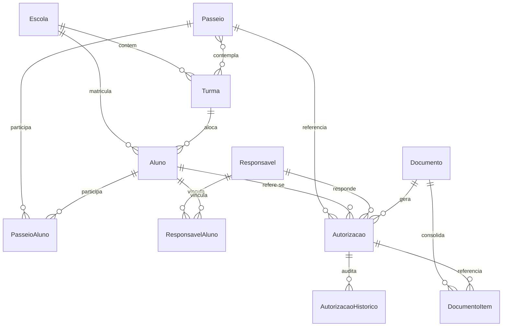
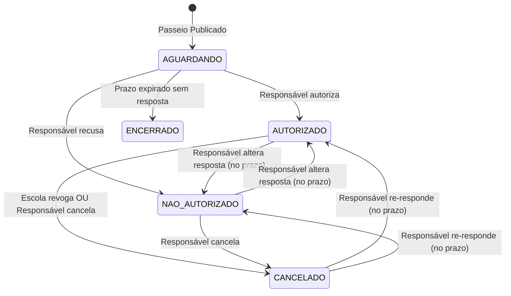

# PRD — Passeio Escolar: Autorização Digital de Alunos

| Metadado | Detalhe |
| :--- | :--- |
| **Documento** | Product Requirements Document (PRD) |
| **Produto** | Passeio Escolar — Sistema de Autorização Digital de Alunos (AutorizaEscolar) |
| **Versão** | 1.0.0 |
| **Status** | Em Produção / Demonstração |
| **Data** | 2026-09-30 |
| **Público-Alvo** | Responsáveis Legais, Diretores, Secretarias de Educação e Fiscais |

---

## 1. Visão Geral do Produto

### 1.1 Contexto e Justificativa
O processo tradicional de autorização de passeios e excursões escolares baseia-se em formulários impressos entregues aos alunos. Esse modelo acarreta:
- **Perda ou extravio constante de papéis**, impedindo a participação de alunos e atrasando a organização das escolas.
- **Falta de verificação de autenticidade**, permitindo assinaturas forjadas ou sem a ciência dos responsáveis legais.
- **Insegurança jurídica e ausência de trilha de auditoria**, dificultando a comprovação tempestiva perante órgãos de fiscalização e seguradoras em caso de incidentes.
- **Sobrecarga operacional**, exigindo contagem manual, compilação de listas de presença e comunicação telefônica de última hora.

O **Passeio Escolar — Autorização Digital de Alunos** substitui o bilhete em papel por uma plataforma web *mobile-first*, intuitiva, segura e com registro auditável em tempo real, gerando comprovantes em PDF com QR Code de autenticação criptograficamente verificável (SHA-256).

### 1.2 Proposta de Valor
- **Para o Responsável Legal:** Facilidade de autorizar ou não a participação do filho diretamente pelo celular em menos de 1 minuto, sem necessidade de instalar aplicativos ou memorizar senhas complexas, com acesso imediato ao comprovante.
- **Para a Escola e Professores:** Painel em tempo real com o status de cada aluno, geração imediata de listas de embarque e relatórios em PDF/Excel, além de gestão segura de revogações.
- **Para a Secretaria de Educação (Rede):** Governança unificada sobre todas as escolas e turmas, conformidade estrita com a LGPD, histórico imutável para auditoria e padronização dos termos legais.

---

## 2. Personas e Perfis de Usuário

| Persona | Perfil | Objetivos Principais | Dores Enfrentadas |
| :--- | :--- | :--- | :--- |
| **Responsável Legal** | Pais, mães, tutores legais de alunos matriculados na rede escolar | Consultar detalhes dos passeios dos filhos, autorizar ou recusar a ida com ciência das normas e emitir comprovante digital | Falta de tempo, perda de bilhetes impressos na mochila, esquecimento de prazos |
| **Gestor da Escola** | Diretores, coordenadores e secretários escolares | Acompanhar a adesão por turma, identificar alunos sem resposta, revogar autorizações quando necessário e emitir listas de presença | Fazer conferência manual de caneta, falta de contato ágil com os pais |
| **Administrador da Rede** | Gestores da Secretaria Municipal de Educação | Cadastrar escolas, turmas e passeios, importar bases de dados, configurar regras globais e auditar operações | Dificuldade de consolidação de dados de múltiplos polos escolares |
| **Fiscal / Monitor** | Monitores de transporte e agentes na portaria de eventos | Conferir rapidamente a validade da autorização lendo o QR Code do documento apresentado pelo responsável ou aluno | Necessidade de checagem imediata sem expor dados pessoais protegidos por lei |

---

## 3. Arquitetura e Stack Tecnológica

```
+--------------------------------------------------------------------------+
|                        CAMADA CLIENTE (BROWSER)                         |
|  Responsável (Mobile Web)  |  Painel Administrativo  |  Validação Pública |
+--------------------------------------------------------------------------+
                                     |
                                HTTPS / REST
                                     v
+--------------------------------------------------------------------------+
|                       APLICAÇÃO FLASK (PYTHON 3.12+)                     |
|  - security.py (HMAC-SHA256, CSRF, Rate Limiting, Session Cookies)        |
|  - Blueprints: public.py (Pais/Validação), admin.py, api.py (REST JSON)  |
|  - services/ (autorizacao, documento, passeio, relatorio, auth, cadastro)|
+--------------------------------------------------------------------------+
              |                                            |
              v                                            v
+----------------------------+             +-------------------------------+
|     SUPABASE / DATABASE    |             |       GERADOR DE DOCUMENTOS   |
|  - PostgreSQL (com RLS)    |             |  - ReportLab (PDF A4 + QR)    |
|  - Supabase Authentication |             |  - openpyxl (Planilhas XLSX)  |
|  - Pgcrypto (hashes CPF)   |             |  - Hash SHA-256 Determinístico|
+----------------------------+             +-------------------------------+
```

### 3.1 Tecnologias Adotadas
- **Linguagem & Framework:** Python 3.12+ com Flask (padrão Application Factory e Blueprints).
- **ORM & Banco de Dados:** SQLAlchemy e Alembic (migrations). PostgreSQL no Supabase (Session Pooler) para produção; SQLite em memória/arquivo para testes e desenvolvimento.
- **Frontend:** Vanilla HTML5, CSS3 estruturado e JavaScript nativo sem dependências de frameworks pesados, garantindo carregamento ultrarrápido em redes móveis (3G/4G).
- **Geração de PDF & QR Code:** ReportLab com modo determinístico (`invariant=True`), garantindo reprodutibilidade binária e integridade de hash SHA-256.
- **Exportação de Dados:** `openpyxl` (planilhas Excel .xlsx com proteção contra injeção de fórmulas CSV/Excel).
- **Autenticação Administrativa:** Supabase Authentication (OAuth/JWT via REST API) com fallback para credenciais locais (Werkzeug hash) para ambientes isolados.

---

## 4. Requisitos Funcionais (RF)

### Módulo 1: Autenticação e Acesso do Responsável
- **[RF01.1] Autenticação Simplificada:** Acesso via CPF do responsável legal. O sistema normaliza os 11 dígitos e busca no banco através do hash HMAC-SHA256 com chave privada (`CPF_PEPPER`).
- **[RF01.2] Segundo Fator Plugável (2FA):** Suporte nativo à confirmação por Data de Nascimento do responsável (armazenada como HMAC). Arquitetura preparada para extensão com SMS, E-mail ou Gov.br.
- **[RF01.3] Proteção Anti-Força Bruta e Enumeração:**
  - Limite máximo de tentativas por IP (ex: 10 tentativas / 15 min) e por CPF (ex: 5 falhas / 15 min).
  - Respostas genéricas de erro quando o 2FA falha para não revelar se o CPF está cadastrado.
- **[RF01.4] Gestão de Sessão:** Sessão segura com cookies `HttpOnly`, `SameSite=Lax`, expiração automática em 30 minutos de inatividade e proteção CSRF em todas as requisições mutativas.

### Módulo 2: Portal do Responsável e Autorizações
- **[RF02.1] Visão de Passeios:** Listagem de todos os passeios ativos em que pelo menos um aluno vinculado ao responsável esteja incluído. Redirecionamento automático caso haja apenas um passeio ativo.
- **[RF02.2] Vinculação de Alunos:** O responsável só visualiza e responde por alunos cujo vínculo esteja ativo e marcado como `responsavel_legal = True`.
- **[RF02.3] Registro de Situação:** O responsável pode definir para cada filho:
  - `AUTORIZADO`
  - `NAO_AUTORIZADO`
  - `CANCELADO` (cancelamento de resposta anterior dentro da janela permitida).
- **[RF02.4] Termo Legal de Ciência:** O envio da resposta exige aceite expresso e obrigatório da declaração de responsabilidade civil e ciência das regras do evento.
- **[RF02.5] Transação Atômica:** Gravação de múltiplos filhos na mesma operação de forma atômica — se uma validação falhar, nenhuma alteração é persistida.
- **[RF02.6] Prevenção de Duplicidade e Resposta Concorrente:**
  - Recusa de submissão idêntica ao estado atual.
  - Bloqueio quando outro responsável legal já tiver respondido, exibindo indicador "registrado por outro responsável" sem expor dados confidenciais do terceiro.
- **[RF02.7] Regras de Edição e Prazo:** Alterações são permitidas apenas se o passeio estiver com `permite_alteracao = True`, antes da `data_limite` e dentro do limite em horas (`prazo_alteracao_horas`), se configurado.

### Módulo 3: Comprovante Digital (Documento e QR Code)
- **[RF03.1] Emissão de Documento Imutável:** Geração de registro `Documento` contendo snapshot JSON (`conteudo`) com fotografia completa dos dados no instante do aceite (instituição, responsável, passeio, alunos, declaração e timestamp local).
- **[RF03.2] Identificadores de Rastreabilidade:**
  - Protocolo sequencial anual legível (ex: `AUT-2026-000001`).
  - Código público de validação alfanumérico aleatório de 48 bits formatado em blocos (ex: `A1B2-C3D4-E5F6`).
- **[RF03.3] PDF Determinístico:** Renderização A4 com ReportLab gerando hash SHA-256 idêntico caso o documento seja regerado a partir do snapshot.
- **[RF03.4] QR Code de Validação:** Impresso no documento apontando diretamente para a rota pública de validação (`/validar/<codigo>`).
- **[RF03.5] Agrupamento Familiar:** Quando um responsável responde por múltiplos filhos no mesmo ato, gera-se **um único PDF** consolidado com itens detalhados por aluno.

### Módulo 4: Validação Pública de Autenticidade
- **[RF04.1] Consulta Pública:** Acesso aberto via URL ou leitura do QR Code sem necessidade de login.
- **[RF04.2] Resguardo de Privacidade (LGPD):** A página de validação exibe apenas dados estritamente necessários: confirmação de vigência, protocolo, nome do passeio, data do evento, timestamp do registro e **nomes dos alunos abreviados/iniciais**, sem expor CPFs ou dados cadastrais do responsável.
- **[RF04.3] Status de Vigência:** O validador informa expressamente se o documento é o **Vigente**, se foi **Substituído** por autorização posterior ou se foi **Cancelado** pela instituição.
- **[RF04.4] Rate Limiting:** Proteção por IP contra varredura automática de códigos de validação.

### Módulo 5: Painel Administrativo e Gestão Escolar
- **[RF05.1] Controle de Acesso Baseado em Papéis (RBAC):**
  - **Perfil ADMIN:** Acesso total à rede ou restrito a uma unidade escolar vinculada.
  - **Perfil COMUM:** Acesso com permissões granulares configuráveis (`revogar`, `exportar`, `cadastros`, `escolas`, `auditoria`, `passeios`, `configuracoes`, `usuarios`).
  - **Escopo Hierárquico:** Usuários associados a uma escola específica visualizam e operam unicamente dados e alunos daquela escola.
- **[RF05.2] Dashboard com Indicadores e Filtros Dinâmicos:**
  - Métricas em tempo real: Total de Alunos, Autorizados, Não Autorizados, Aguardando e Revogados/Cancelados.
  - Filtros cruzados por Passeio, Escola, Ano de Ensino, Turma, Situação e busca nominal sem acentuação.
- **[RF05.3] Revogação Administrativa:**
  - Possibilidade de revogar autorização individualmente ou em lote (por seleção de alunos, por página ou por filtro completo).
  - Justificativa textual obrigatória gravada na trilha de auditoria e no histórico do aluno.
  - Reabertura do status para permitir nova resposta do responsável caso ainda esteja dentro do prazo.
- **[RF05.4] Emissão de Relatórios:** Exportação nos formatos **CSV**, **XLSX (Excel)** e **PDF pronto para impressão/embarque** com cabeçalho institucional e brasão oficial.

### Módulo 6: Cadastros Básicos e Configurações
- **[RF06.1] Gestão de Passeios:** Criação e parametrização com destino, ponto de encontro, transporte, datas e horários, orientações, turmas elegíveis, prazos e versionamento automático de termos de autorização.
- **[RF06.2] Gestão de Escolas e Turmas:** Cadastro com código INEP, CNPJ, dados de direção, endereço e geração automatizada de turmas com base na modalidade de ensino.
- **[RF06.3] Gestão de Alunos e Responsáveis:** Cadastro manual ou importação de lotes via JSON/SQL do sistema de gestão escolar integrado com `pgcrypto`.
- **[RF06.4] Identidade Visual:** Personalização do nome da instituição, títulos do portal, upload de brasão municipal e galeria de ilustrações para eventos.

### Módulo 7: Auditoria e Conformidade
- **[RF07.1] Registro Imutável (Audit Log):** Log com timestamp UTC, identificação do ator (Responsável, Admin, Público, Sistema), ação realizada, alvo, IP e User-Agent.
- **[RF07.2] Histórico de Autorização:** Cada transição de estado da autorização é gravada em tabela própria (`AutorizacaoHistorico`), garantindo rastreabilidade pericial de quem autorizou, cancelou ou revogou.

---

## 5. Requisitos Não-Funcionais (RNF)

| Identificador | Categoria | Descrição |
| :--- | :--- | :--- |
| **RNF01** | **Segurança & LGPD** | O CPF nunca é gravado em texto puro. Utiliza-se HMAC-SHA256 com `CPF_PEPPER` secreto e guarda-se apenas os dois últimos dígitos para máscara de conferência (`***.***.***-99`). |
| **RNF02** | **Segurança HTTP** | Implementação de cabeçalhos de segurança: Content Security Policy (CSP), `X-Content-Type-Options: nosniff`, `X-Frame-Options: SAMEORIGIN`, e `Cache-Control: no-store` em telas com dados pessoais. |
| **RNF03** | **Performance** | Tempo de resposta para carregamento das telas do responsável inferior a 1,5 segundo em conexões móveis. Geração de PDF sob demanda em menos de 800ms. |
| **RNF04** | **Integridade de Dados** | Snapshot imutável (`JSON`) na tabela de documentos, impedindo que futuras edições do passeio corrompam os termos assinados no passado. |
| **RNF05** | **Mobile-First UX** | Interface totalmente responsiva otimizada para telas de smartphones, com componentes de toque ergonômicos e tipografia legível. |
| **RNF06** | **Disponibilidade & Nuvem** | Arquitetura stateless no servidor web compatível com contêineres e provedores PaaS (ex: Render) e banco de dados gerenciado (Supabase). |
| **RNF07** | **Sanitização de Saída** | Prevenção contra injeção de fórmulas (*CSV Injection*) em relatórios gerados para Excel, prefixando caracteres como `=`, `+`, `-`, `@`. |

---

## 6. Modelo de Dados e Entidades

### 6.1 Diagrama Conceitual Entidade-Relacionamento



### 6.2 Dicionário Resumido de Entidades

1. **`Escola`**: Unidade escolar da rede (INEP, CNPJ, modalidade, endereço, contatos).
2. **`Turma`**: Agrupamento escolar associado a uma Escola (Ano/Série e Nome, ex: "6º Ano — Turma A").
3. **`Aluno`**: Estudante matriculado com vínculo a uma turma e escola (nome, matrícula, CPF mascarado, dados externos).
4. **`Responsavel`**: Titular do pátrio poder (nome, `cpf_hash`, `cpf_final`, telefone, e-mail, hash de 2FA).
5. **`ResponsavelAluno`**: Vínculo entre responsável e aluno, com marcação de `responsavel_legal` (apenas quem possui a marcação pode autorizar).
6. **`Passeio`**: Evento/excursão com dados de logística, horários, turmas, data limite, termos legais versionados e opções de imagem.
7. **`PasseioAluno`**: Associação dos alunos aptos a participar do passeio.
8. **`Autorizacao`**: Estado atual do par (Passeio, Aluno) contendo a situação (`AUTORIZADO`, `NAO_AUTORIZADO`, etc.).
9. **`AutorizacaoHistorico`**: Registro histórico imutável das mudanças de estado da autorização.
10. **`Documento`**: Comprovante emitido de uma operação contendo snapshot JSON, código de validação e hash SHA-256.
11. **`DocumentoItem`**: Itens contidos dentro de um documento comprobatório.
12. **`AdminUsuario`**: Operadores do sistema com perfis de rede ou unidade escolar.
13. **`AuditLog`**: Log de auditoria geral do sistema.

### 6.3 Ciclo de Vida da Situação do Aluno



---

## 7. Fluxos do Usuário (User Flows)

### 7.1 Fluxo do Responsável (Autorização via Mobile)
1. **Entrada:** Responsável acessa a raiz do sistema (`/`) no navegador móvel.
2. **Identificação:** Digita o CPF (e data de nascimento se 2FA ativo).
3. **Seleção:** Visualiza o passeio ativo e o cartão de cada filho matriculado que participa do evento.
4. **Decisão:** Seleciona "Autorizar" ou "Não Autorizar" para cada dependente.
5. **Ciência:** Marca o checkbox obrigatório concordando com a declaração legal de autorização e transporte.
6. **Confirmação:** Confirma no modal de segurança.
7. **Emissão:** O sistema exibe o comprovante digital com protocolo, código de validação, botão para visualização/download do PDF e QR Code.

### 7.2 Fluxo Administrativo (Gestão e Embarque)
1. **Acesso:** Login em `/admin` com autenticação Supabase ou credencial local.
2. **Visão Geral:** Dashboard apresenta os indicadores agregados do passeio selecionado.
3. **Filtragem:** Gestor filtra por sua escola e turma de interesse para verificar autorizações pendentes.
4. **Ação Operacional:**
   - Emite a lista de embarque em PDF com os alunos autorizados.
   - Em caso de impedimento de aluno, realiza a revogação com justificativa registrada.

### 7.3 Fluxo do Fiscal / Validação Externa
1. **Escaneamento:** Agente aponta a câmera do celular para o QR Code impresso ou na tela do aparelho do responsável.
2. **Redirecionamento:** O navegador abre a rota pública `/validar/<codigo>`.
3. **Resultado:** O sistema retorna imediatamente cartão verde (Vigente e Válido), amarelo (Substituído por termo posterior) ou vermelho (Cancelado/Inválido), garantindo conferência segura sem vazamento de dados.

---

## 8. Considerações de Segurança e LGPD

1. **Minimização de Dados:** Fotos de menores não são armazenadas no sistema; a interface utiliza avatares com as iniciais do aluno.
2. **Proteção Criptográfica de Identificadores:** CPFs de responsáveis e alunos são guardados exclusivamente sob HMAC com chave de aplicação e salt interno no banco (`pgcrypto`).
3. **Prevenção de Ataques a Sessões:** Session cookies isolados, `HttpOnly`, proteção contra clickjacking (`X-Frame-Options`) e validação estrita de token CSRF em chamadas POST da API e do portal.
4. **Isolamento de Escopo:** Consultas SQL no painel de administração sempre aplicam filtros obrigatórios pelo `escola_id` do operador logado, impedindo vazamento de dados inter-escolas.

---

## 9. Roadmap de Evolução Futura

- [ ] **Notificações Ativas:** Disparo automatizado de avisos de prazo e links de autorização via WhatsApp Business API e SMS.
- [ ] **Módulo PWA para Embarque Offline:** Validador offline em Progressive Web App com sincronização posterior para locais sem cobertura de internet (ex: áreas rurais ou terminais rodoviários).
- [ ] **Integração Gov.br:** Autenticação unificada através da conta Gov.br (níveis Prata/Ouro) para dispensa de verificação complementar.
- [ ] **Assinatura Eletrônica Avançada:** Integração com carimbo de tempo e certificado ICP-Brasil para viagens interestaduais ou de longa duração.
- [ ] **Módulo de Saúde & Alergias:** Inclusão facultativa e autorizada de ficha médica de emergência (alergias, medicações de uso contínuo e contato de emergência).
